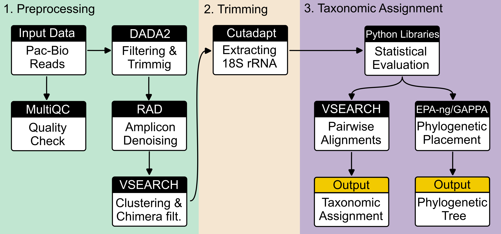

# Vampyrellid diversity exploration 2023

## Table of Contents
1. [Project Description](#project-description)
2. [Initial Data](#initial-data)
3. [Project Workflow Overview](#project-workflow-overview)
4. [Step-by-Step Process Flow](#step-by-step-process-flow)
5. [Reference Alignments and Trees](#reference-alignments-and-trees)
6. [Project Folder Hierarchy](#project-folder-hierarchy)
7. [How to Replicate the Project Analyzes](#how-to-replicate-the-project-analyzes)

## Project Description

This project aims to explore Vampyrellid's diversity using long-read metabarcoding of the eukaryotic rDNA operon.

## Initial data

In total, we collected nine environmental samples and one mock sample (Table 1). All environmental DNA has been extraced using the Qiagen's PowerSoil Powerlyser Kit, and sent to sequencing facility at Dalhousie University (Halifax, Canada). The IMR sequenced the full 18S rRNA amplicon fragments using the Sequel II instrument (Pacific Biosciences) on an SMRT Cell 8M Tray.
The details on librabry preparation, and sequencing are described on the IMR website: https://imr.bio/protocols.html.

We received demultiplexed raw reads in fastq format with phred+33 encoding from IMR. \
Files: /raw_data/PacBio/<project_name>/{cell1, cell2}


## Project workflow overview



## Step-by-Step Process Flow: Scripts and Data I/O
The table below provides a detailed look at each step in our bioinformatics analysis pipeline, including the scripts used and the corresponding input and output data.

|Step                  | Script                                            | Input                            | Output                                         |
|----------------------|---------------------------------------------------|----------------------------------|------------------------------------------------|
|Initial steps         | [`init_steps_01_merge_cells.sh`][script1]         | raw_data/PacBio -> Cell 1, 2     | raw_data/PacBio -> cellCombined                |
|Quality check         | [`init_steps_02_read_quality.sh`][script2]        | raw_data/PacBio -> cellCombined  | results -> [multiqc][multiqc]                  |
|Trimming              | [`tax_assign_01a_dada2_trimming.r`][script3]      | raw_data/PacBio -> cellCombined  | raw_data/dada2 -> noprimers                    |
|Filtering             | [`tax_assign_01b_dada2_filtering.r`][script4]     | raw_data/dada2 -> noprimers      | raw_data/dada2 -> filtered                     |
|Denoising             | [`tax_assign_02_RAD.sh`][script5]                 | raw_data/dada2 -> filtered       | raw_data/denoised -> RAD                       |
|Clustering            | [`tax_assign_03_cluster_otu.sh`][script6]         | raw_data/denoised -> RAD         | raw_data/clustered -> sim_xy                   |
|Chimera filtering     | [`tax_assign_04_chimera_filt.sh`][script7]        | raw_data/clustered -> sim_xy     | raw_data -> chimera_filtered                   |
|Tax. assign. (VSEARCH)| [`tax_assign_05_taxassign.sh`][script8]           | raw_data -> chimera_filtered     | results -> [tax_assignment_vsearch][ta_vsearch]|
|Phylogenetic placement| [`phyl_placement_01_phylo_placement.sh`][script9] | raw_data -> chimera_filtered     | results/phyl_placement -> [jplace][jplace]     |
|Tax. assign. (GAPPA)  | [`phyl_placement_02_taxassign.sh`][script10]      | results/phyl_placement -> jplace | results/phyl_placement -> [tax_assignment_gappa][ta_gappa]     |


[script1]: https://github.com/wRajter/vampyrella_2023/blob/master/scripts/bash/init_steps_01_merge_cells.sh
[script2]: https://github.com/wRajter/vampyrella_2023/blob/master/scripts/bash/init_steps_02_inspect_reads_quality.sh
[script3]: https://github.com/wRajter/vampyrella_2023/blob/master/scripts/bash/tax_assign_01a_dada2_trimming.r
[script4]: https://github.com/wRajter/vampyrella_2023/blob/master/scripts/bash/tax_assign_01b_dada2_filtering.r
[script5]: https://github.com/wRajter/vampyrella_2023/blob/master/scripts/bash/tax_assign_02_RAD.sh
[script6]: https://github.com/wRajter/vampyrella_2023/blob/master/scripts/bash/tax_assign_03_cluster_otu.sh
[script7]: https://github.com/wRajter/vampyrella_2023/blob/master/scripts/bash/tax_assign_04_chimera_filt.sh
[script8]: https://github.com/wRajter/vampyrella_2023/blob/master/scripts/bash/tax_assign_05_taxassign.sh
[script9]: https://github.com/wRajter/vampyrella_2023/blob/master/scripts/bash/phyl_placement_01_phylo_placement.sh
[script10]: https://github.com/wRajter/vampyrella_2023/blob/master/scripts/bash/phyl_placement_02_taxassign.sh
[multiqc]: https://github.com/wRajter/vampyrella_2023/blob/master/results/multiqc
[ta_vsearch]: https://github.com/wRajter/vampyrella_2023/blob/master/results/tax_assignment_vsearch
[jplace]: https://github.com/wRajter/vampyrella_2023/blob/master/results/phyl_placement/jplace
[ta_gappa]: https://github.com/wRajter/vampyrella_2023/blob/master/results/phyl_placement/tax_assignment_gappa


## Phylognetic placement

The script for phylogenetic placement ([`phyl_placement_01_phylo_placement.sh`][script9]) performs a two-step phylogenetic analysis of environmental sequences. In the first step, it processes general eukaryotic samples, aligning them to a reference, evaluating substitution models, and performing phylogenetic placement. During this stage, sequences belonging to the Vampyrella clade are specifically extracted. In the sencond step, the extracted Vampyrellid sequences undergo a refined phylogenetic placement using a Vampyrella-specific reference tree. The script stores log files documenting the process for both eukaryotes and vampyrellids, the extracted vampyrellida-specific sequences are saved in FASTA format, and the results of the phylogenetic placement are preserved in JPLACE files. This two-step approach allows first identifying Vampyrella sequences from the pool of all eukaryotic sequences and then conducting a detailed phylogenetic analysis on them.
The second script ([`phyl_placement_02_taxassign.sh`][script10]) is dedicated to the taxonomic assignment of Vampyrellida sequences, extending the phylogenetic analysis conducted in the first script. Utilizing the results from the previous phylogenetic placement, this script deploys GAPPA to assign taxonomic identities to the sequences. For each sample, it reads the JPLACE files generated earlier, which contain the vampyrellid-specific sequences and their phylogenetic placement information. The script uses these files along with a taxon reference file to assign taxonomic labels to each sequence. Outputs include per-query taxonomic assignment results and a taxonomic profile summary for each sample.


## Reference alignments and trees

For the **taxonomic assignment**, we used the full [PR2 SSU UTAX database (version 5.0.0)](https://github.com/pr2database/pr2database/releases/tag/v5.0.0). We updated the PR2 database with 128 vampyrellid sequences using Python code, see the [modify_pr2_database](https://github.com/wRajter/vampyrella_2023/blob/master/notebooks/modify_pr2_database.ipynb) Jupyter notebook, for a more accurate and refined taxonomic assignment of vampyrellids.

## Project Folder Hierarchy

Below is the structure of the project directory explaining the purpose of each folder:


- **results/**: Contains output from various stages of analysis.
- **notebooks/**: Jupyter notebooks with executable code blocks for analyses.
- **raw_data/**: Raw datasets and intermediate files (not on GitHub due to size constraints; available upon request).
- **scripts/**: This folder contains different subfolders organized by the scripting language or environment used:
  - **bash_scripts/**: Bash scripts for automating command-line tasks.
  - **python_functions/**: Python scripts and modules used in the project.
  - **r_scripts/**: R scripts for data processing and statistical analysis.
  - **sbatch/**: SLURM batch scripts used on a computing cluster.
  - **julia/**: Scripts written in Julia programming language.
- **tests/**: Includes scripts and files used for testing code functionality.
- **vampyrella_2023/**: A directory for the virtual environment to manage project dependencies.


## How to Replicate the Project Analyzes

To replicate the analyses performed in this project, follow the steps below:

### Prerequisites

- [Git](https://git-scm.com/)
- [Python](https://www.python.org/) v3.11
- [Julia](https://julialang.org/) v1.9.2
- [vsearch](https://github.com/torognes/vsearch) v2.22.1
- [FastQC](https://www.bioinformatics.babraham.ac.uk/projects/fastqc/) v0.11.9
- [MultiQC](https://multiqc.info/) v1.17
- [R](https://www.r-project.org/) v4.3.1
- [EPA-ng](https://github.com/pierrebarbera/epa-ng) v0.3.8
- [PaPaRa](https://cme.h-its.org/exelixis/web/software/papara/index.html) v2.5
- [GAPPA](https://github.com/lczech/gappa) v0.8.1

### Environment Setup

1. Clone the project repository:
   ```bash
   git clone https://github.com/wRajter/vampyrella_2023.git
   cd vampyrella_2023
2. (Optional) Create a virtual environment:
    ```bash
    python3.11 -m venv vampyrella_2023
3. Install the required Python packages:
    ```bash
    pip install -r requirements.txt
